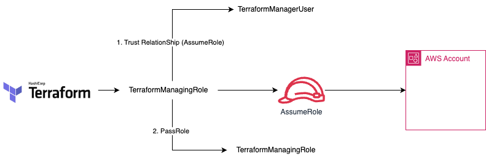
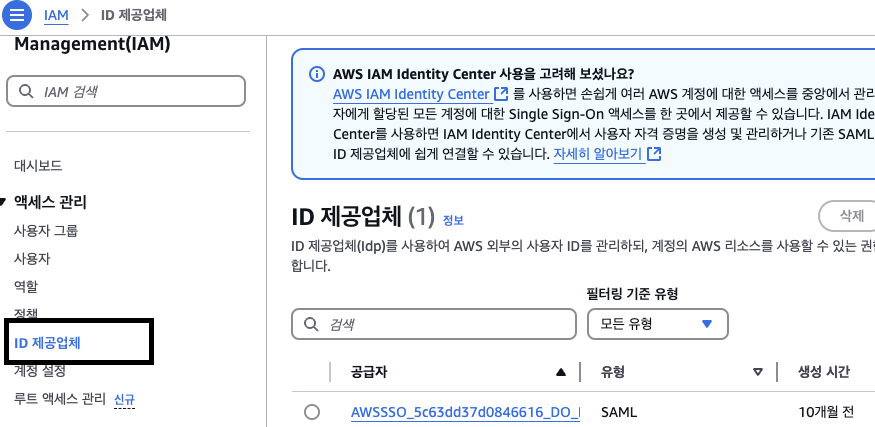
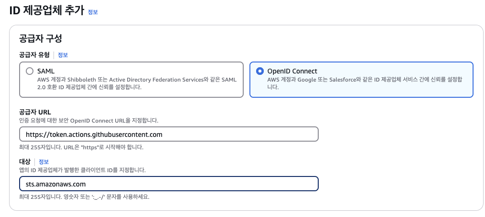
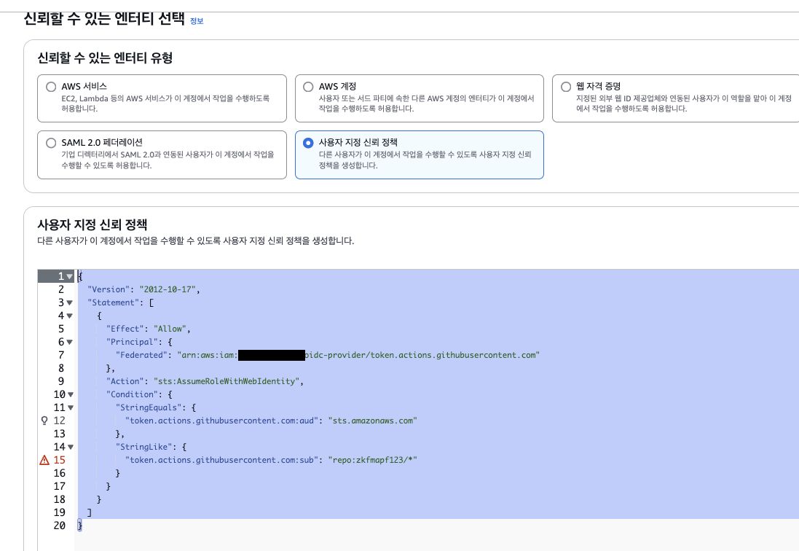

# Security Terraform + Github Actions

## Terraform (Security)

### 기존 방식 (AccessKey, SecretKey)


### AssumeRole을 활용해서 접근하는 방식



- 기존 Credentials Key 방식보다 Role 사용한 방식이 더 안전...
- Role을 사용해서 대신 접근하는 방식

### 구성 방법

1. User 생성

- Create TerraformManagingUser

2. Role 생성

- Create <b>TerraformManageingRole</b>

- Setting Trust Relationship

```json
{
  "Version": "2012-10-17",
  "Statement": [
    {
      "Sid": "Statement1",
      "Effect": "Allow",
      "Principal": {
        "AWS": "arn:aws:iam::<account-id>:user/terraformManagingUser"
      },
      "Action": "sts:AssumeRole"
    }
  ]
}
```

3. 정책

- Create <b>TerraformManagingPolicy</b>

```json
{
  "Version": "2012-10-17",
  "Statement": [
    {
      "Sid": "Statement1",
      "Effect": "Allow",
      "Action": ["iam:PassRole"],
      "Resource": ["arn:aws:iam::<account-id>:role/TerraformManageingRole"]
    }
  ]
}
```

## Github Action (Security)

### 기존 방식 (AccessKey, SecretKey)

- Action Secret에 AccessKey, SecretKey 저장
- 해당 키를 사용해서 인증을 진행

```yaml
name: Upload to S3

on:
  push:
    branches:
      - master
    paths:
      - "index.html"

env:
  AWS_ACCESS_KEY_ID: ${{ secrets.AWS_ACCESS_KEY_ID }}
  AWS_SECRET_ACCESS_KEY: ${{ secrets.AWS_SECRET_ACCESS_KEY }}
  AWS_REGION: ap-northeast-2
  S3_BUCKET: test-bucket-leedonggyu-10

jobs:
  upload:
    runs-on: ubuntu-latest

    steps:
      - name: Checkout code
        uses: actions/checkout@v4

      - name: Configure AWS credentials
        uses: aws-actions/configure-aws-credentials@v4
        with:
          aws-access-key-id: ${{ secrets.AWS_ACCESS_KEY_ID }}
          aws-secret-access-key: ${{ secrets.AWS_SECRET_ACCESS_KEY }}
          aws-region: ap-northeast-2

      - name: Upload to S3
        run: |
          aws s3 cp index.html s3://${{ env.S3_BUCKET }}/index.html
```

### 개선된 방식 OIDC

- OIDC 생성
  

- OIDC 정책 구성

```sh
provider URL : https://token.actions.githubusercontent.com
audience : sts.amazonaws.com
```



- Role 생성 (AssumeRole) - 대신수행

```json
// Trust Relationship
{
  "Version": "2012-10-17",
  "Statement": [
    {
      "Effect": "Allow",
      "Principal": {
        "Federated": "arn:aws:iam::182024812696:oidc-provider/token.actions.githubusercontent.com"
      },
      "Action": "sts:AssumeRoleWithWebIdentity",
      "Condition": {
        "StringEquals": {
          "token.actions.githubusercontent.com:aud": "sts.amazonaws.com"
        },
        "StringLike": {
          "token.actions.githubusercontent.com:sub": "repo:zkfmapf123/*"
        }
      }
    }
  ]
}
```

| 권한 패턴                                            | 설명                                |
| ---------------------------------------------------- | ----------------------------------- |
| repo:ORG-NAME/\_                                     | ORG 내에서는 모두 사용 가능         |
| repo:ORG-NAME/REPO-NAME:\_                           | 저장소 내의 브랜치는 모두 사용 가능 |
| repo:ORG-NAME/REPO-NAME:ref:refs/heads/BRANCH-NAME   | 특정 브랜치에서만 사용 가능         |
| repo:ORG-NAME/REPO-NAME:environment:ENVIRONMENT-NAME | 특정 환경에서만 사용 가능           |


